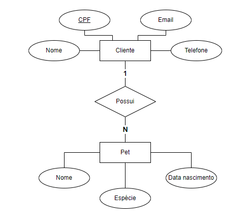
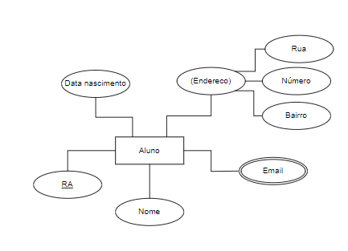
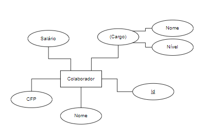

# ExerciciosBancoDeDados
Exercícios da matéria de Banco de Dados do 2º semestre de ADS

### 1.1. PETSHOP: 

Um petshop deseja manter cadastrados seus clientes bem como seus pets. Um cliente deve informar seu nome, cpf, email e telefone além do nome, espécie e data de nascimento de seu pet

O banco de dados está no arquivo [Exercicio1_1.txt](Exercicio1_1.txt)

O MER deste exercício é: 

### 1.2. PRODUTORA DE GAMES: 

Em uma produtora de games, há desenvolvedores, que possuem um nome, CPF, data de nascimento. Cada projeto tem um nome, data de lançamento, gênero e faixa etária. Segundo o gerente de projetos, “cada desenvolvedor deve estar envolvido em um projeto”.

O banco de dados está no arquivo [Exercicio1_2.txt](Exercicio1_2.txt)

O MER deste exercício é: 

### 2.1. BIBLIOTECA: 

Uma biblioteca efetua registro de autores e livros. Um autor é cadastrado com seu nome, e-mail, nacionalidade e data de nascimento. Já um livro é registrado com o título, quantidade de páginas, acabamento e editora.

O banco de dados está no arquivo [Exercicio2_1.txt](Exercicio2_1.txt)

O MER deste exercício é: 

### 2.2. LOCADORA DE AUTOMÓVEIS: 

Uma locadora de automóveis, mantém registro dos automóveis. Um automóvel é cadastrado com placa, modelo, ano, nome da montadora, site da montadora, logotipo da montadora.

O banco de dados está no arquivo [Exercicio2_2.txt](Exercicio2_2.txt)

O MER deste exercício é: 

### 2.3. SUPERMERCADO: 

Um supermercado cadastra seus produtos. Um produto é identificado por seu nome, preço, quantidade em estoque, nome da marca, SAC da marca, nacionalidade da marca.

O banco de dados está no arquivo [Exercicio2_3.txt](Exercicio2_3.txt)

O MER deste exercício é: 

### 2.4. VIDEOTECA: 

Uma videoteca precisa cadastrar o título, duração, idioma original e preço de cada filme. É necessário cadastrar também o elenco de cada filme onde se registra o nome, data de nascimento, nacionalidade de cada ator/atriz. Opcionalmente, inclua o cadastro de diretores com atributos que julgar necessários.

O banco de dados está no arquivo [Exercicio2_4.txt](Exercicio2_4.txt)

O MER deste exercício é: 

### 3.1. ALUNOS: 

Um aluno deve ter RA, nome, data de nascimento, endereço e e-mail

O banco de dados está no arquivo [Exercicio3_1.txt](Exercicio3_1.txt)

O MER deste exercício é: 

### 3.2. COLABORADORES: 

Um colaborador deve ter um código de identificação, nome, CPF, cargo e salário

O banco de dados está no arquivo [Exercicio3_2.txt](Exercicio3_2.txt)

O MER deste exercício é: 

